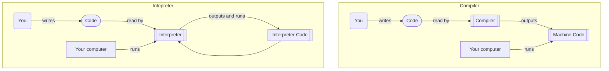
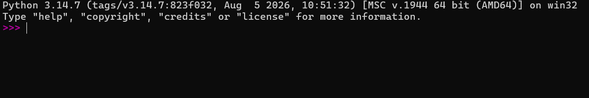
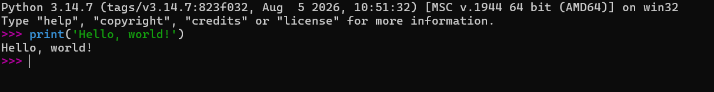
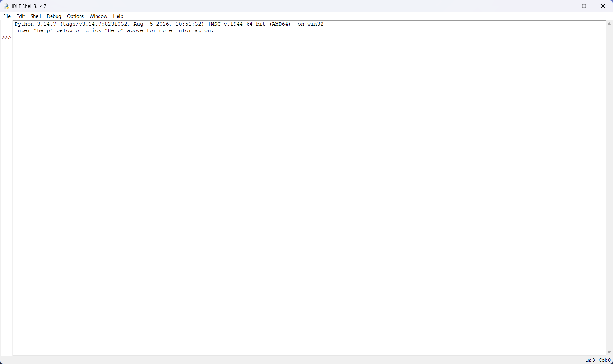
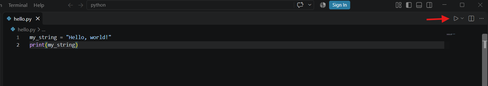

# How Python Works


## The Interpreter

Python can be considered an *interpreted* programming language, which means it uses something called an *interpreter* to run. Roughly speaking, an *interpreter* is a program on your computer that acts as a kind of "computer within a computer". This computer is often very simple, and is designed to:
1. Read statements made in a certain programming language
2. "Interpret" the statements, that is, turn them into instructions that it understands, and then follow them. Instructions can be anything from doing a math calculation, to printing something to the screen, to creating or changing a variable.

Most instructions will change the state of the Python interpreter. For example, take an assignment operation:
```python
my_number = 42
```
This instruction tells the interpreter to add an object with the value `42` to its memory, and to create a `my_number` variable to refer to it. Generally speaking, **the interpreter keeps its memory in between instructions for as long as it lives (i.e. until you close it or shut off your computer)**. To continue with the example, if we now give the interpreter a `print()` statement:
```python
print(my_number)
```
The interpreter will remember the `my_number` variable it assigned before and give its value to the `print()` function. If you were to give a *new* interpreter this instruction, it would give you an error, because it has a blank memory independent of any previous interpreters.

:::info

"Interpreted languages" are often contrasted with "compiled languages" (e.g., the C language). Compiled languages use a *compiler* instead of an *interpreter*. The difference between the two is a little blurry and not necessary to learn for this guide. 

<details>
A compiler takes human-made code and transforms it into code your computer can understand directly. No extra program is necessary to run the code after the compiler has compiled it. On the other hand, an interpreter takes human-made code and transforms it into code that *it* can understand, and then executes it. Your computer runs the interpreter, and the interpreter runs your code. Importantly, the interpreter is always necessary to run the code.


</details>
:::


## How to run Python code using the Python Interpreter  

### The Shell

The Python shell is probably the easiest way to run Python code. It allows you to give the Python Interpreter instructions one-by-one, and easily see the value of any variable you declare.

There are two main ways to run a Python shell: via a **terminal**, and through  **IDLE**, which was likely installed alongside Python.

#### The Terminal

To access a python shell through the terminal (e.g. [Windows Terminal](https://apps.microsoft.com/detail/9n0dx20hk701) or the [MacOS Terminal](https://support.apple.com/en-ca/guide/terminal/apd5265185d-f365-44cb-8b09-71a064a42125/mac)), open the terminal and enter the `python3` command. This should begin a python shell that looks similar to this:

From here, you can type in any python instruction, and the python interpreter will run it:


:::note
Running `python3` in another terminal window will start a **second** Python interpreter and shell, completely separate from the first.
:::


#### IDLE

Python provides its own shell environment via a program called `IDLE`. Find and run it as you would any other program, and you should be greeted with an interface like this:


As with the Terminal, you can enter python code into the shell and the interpreter will run it.

### Python Scripts

:::warning
Writing Python scripts is not recommended without a code editor, like [Visual Studio Code](https://code.visualstudio.com/).
:::

Python scripts are text files containing Python code. When given a script, the python interpreter will read and execute all the instructions in the script from top to bottom. Think of it as giving a series of prepared instructions to the shell. When the interpreter has executed all instructions in the script, it will exit on its own. 

To run a script, you can give the name of the script as a parameter to the `python3` command. For example, given this script named `hello.py`:
```python title="hello.py"
my_string = "Hello, world!"
print(my_string)
```
You can run it using:
```bash
python3 hello.py
```
Which should give you the expected `"Hello, World!"`.

Your code editor may also provide its own way to run a Python script. With the [Python extension](https://marketplace.visualstudio.com/items?itemName=ms-python.python) enabled in VS Code, you may click the "play" button above the file window to run the script. It will automatically open a terminal window and run the file for you.


:::tip
While not strictly necessary, you should always give your Python scripts a `.py` file extension. This signals to your operating system and other programs that the file is a Python script.
:::

### Interactive Notebooks (Jupyter)

Interactive notebooks combine regular text with Python code. Inside of an interactive notebook are "code cells", which can be thought of as Python scripts embedded inside of the document. You can usually run code in a code cell by pressing `ctrl+enter` when inside the cell. Every code cell in the notebook "shares" the interpreter, so running one code cell may affect the others.


