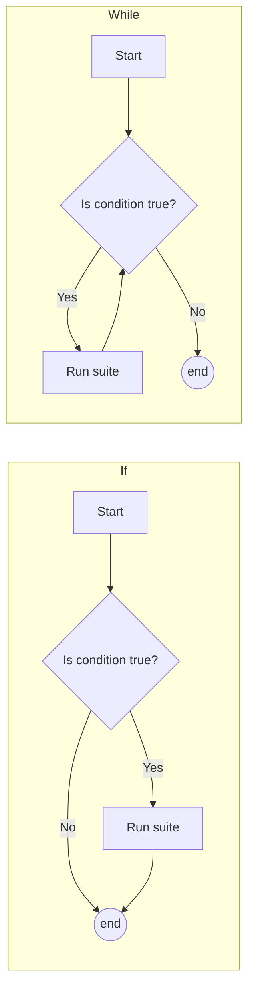

# Python Statements

In short, a *statement* is any valid Python instruction. Some statements (e.g. `if` statements, `for` statements, etc.) may contain other statements.

```python
# The following are all statements:
5 

3 + 7 * 8

"Hello"

x = "hello"

print(x)

# Note: the following two lines are all one (1) if statement.
if True == False: # True == False is a statement on its own!
    print("The world is ending!") # this line is also a statement on its own, and so is the string "The world is ending!"!
```

## Expressions

Many statements can be *evaluated* to a value. For example:
```python
1 + 2 * 3 ** 4
```
Will *evaluate* to the number that results from these mathematical [operations](./data-types#numerical-operators). In this case, `163`.

Statements that *evaluate* to a certain value are called *expressions*. Many statements in Python require expressions to be in certain places. For example:

## Assignments

One very common statement is an *assignment*. This is what lets you give names to certain expressions. Note that an assignment is not an expression; it does not have a value. An *assignment* follows this general syntax:
```python
my_var = my_expr
```
Where `my_var` is the name you want to give to an expression, and `my_expr` is that very expression. `my_expr` **must** be an expression, or else an error will occur.
Once this assignment statement is run, `my_var` becomes a *name* that refers to an *object* in memory. This object will have the value and type of `my_expr`. Another effect of this assignment is that `my_var`, as a name, *becomes* an expression. In fact, it becomes an expression that evaluates to the same value as `my_expr`. You can now use `my_var` in any place that requires an expression, like another assignment statement.

## Control Flow

In very simple Python scripts, every line gets executed by the interpreter. For example:
```python
# Age Calculator

current_year = 2026
birth_year_string = input("Enter your birth year: ") # Take the user's input, 
birth_year = int(birth_year_string)

age = current_year - birth_year
print(f'Your age is {age}!')
```
This script will always run line 1, then 2, then 3, etc. until it either gets to the end of the file or an error occurs. This is too rigid for most use cases. For example, what if the user does not give a valid number as a birth year? Surely we would want to run *different* lines of code depending on the circumstances.

"Control Flow" refers to the ability to control the "flow" of code in just this fashion. Sometimes we don't want every line of code to be run, and sometimes we want different lines of code to be run, and sometimes we even want the same lines of code to be run *more than once*. To accomplish this, we can use `if`, `while`, and `for` statements. 

### `if` Statements

`if` statements allow you to only run some lines of code when a given expression is true. It looks like this:
```python
if condition:
    suite
```
Here, `condition` can be any valid python expression. The type of the expression should usually be a `bool`, and this is what we will focus on for now.
`suite` represents one or more statements that will **only** run when `condition` evaluates to `True`. These statements are given line by line as normal, and must be indented.

Indentation is how Python knows whether knows whether a statement following an `if` statement is a part of the `suite`, or if it is simply a statement *after* the `if` statement. This is also true of `while` and `for` statements below.

```python
if condition:
    print("I'm in the if statement, I only run if condition is True.")
print("I'm outside of the if statement, I always run.")
```

#### `condition`s

It is important to restate that the `condition` of an `if` statement can be **any expression**, but for most use cases we limit it to **any expression that evaluates to a `bool`**. This is where [Boolean Operators](./data-types.md#boolean-operators) can really shine, because they naturally result in `bool`s!


<span id="truthiness"></span>
:::info
 **"Truthy" and "Falsy" values** 

If an `if` statement can accept any expression as a `condition`, how does it handle values that are not `True` or `False`? The answer is that every expression, no matter the type, has a "truthiness value", which is either "Truthy" or "Falsy". When an `if` statement receives a non-`bool` expression, it will use the truthiness value of the expression to choose whether or not to run its `suite`. In general, all values are "Truthy" except for the following, which are "Falsy":
- `None`
- `False`
- Any number-typed value with a value of `0` (including `0.0`)
- Any empty sequence-type value (`""`, `()`, `[]`)
::: 

Our current age calculator is quite error prone. If the user enters a non-number as a string, our `int()` call will throw an error. We can use an `if` statement  to only run the rest of the script if the string actually repesents an integer. To check if a string only contains digits, we can use the built-in string method, `isdigit()`. `isdigit()` returns `True` if every character is a digit (i.e., `0` to `9`), otherwise it returns `False`.

Our more robust code looks like this:
```python
# Age Calculator

current_year = 2026
birth_year_string = input("Enter your birth year: ") # Take the user's input, 
if birth_year_string.isdigit():
    birth_year = int(birth_year_string)

    age = current_year - birth_year
    print(f'Your age is {age}!')
```
Now, the rest of the script will only run if `birth_year_string` contains all digits (i.e., it is an integer). No more errors from `int()`!

However, if the user does give an invalid value, the `if` statement will see that `birth_year_string.isdigit()` is `False`, and will skip over its suite. Since there is no code after the `if` statement, script will stop there, and the user will have no idea what they did wrong. The `else` keyword can help with that.

#### `else` and `elif`

Often, it is useful to run one set of statements if a condition is `True`, **and** another set of statements if that same condition is `False`. An `if` statement only lets you run some statements if a condition is `True`. The `else` keyword allows you to run statements if that condition turns out to be `False`. Let's use the `else` keyword to tell the user when they have given an invalid input:

```python
# Age Calculator

current_year = 2026
birth_year_string = input("Enter your birth year: ") # Take the user's input, 
if birth_year_string.isdigit(): # if birth_year_string is an integer, proceed to calculate
    birth_year = int(birth_year_string)

    age = current_year - birth_year
    print(f'Your age is {age}!')
else: # if birth_year_string is NOT an integer, tell the user.
    print(f"'{birth_year_string}' is not a valid integer!")
    
```
As you can see, the `else` part of the `if` statement has its own `suite`, which only runs when `birth_year_string.isdigit()` evaluates to `False`. Now our script will always give the user *some* feedback.

There are other ways the user could give invalid input, though. For example, if their age is too low, or too high, it is likely incorrect. Let's add some more `if` statements to account for this.

```python
# Age Calculator

current_year = 2026
birth_year_string = input("Enter your birth year: ") # Take the user's input, 
if birth_year_string.isdigit(): # if birth_year_string is an integer, proceed to calculate
    birth_year = int(birth_year_string)

    age = current_year - birth_year

    if age < 0: # First, check if age is negative
        print("You're not even born yet!")
    else: # if age is not negative, continue here
        if age > 150: # check if age is above 150
            print("You're way too old!")
        else: #if age is not above 150, continue here. (Note that we are still in the "else" statement of "if age < 0", so we also know age is not negative)
            print(f'Your age is {age}!')
else: # if birth_year_string is NOT an integer, tell the user.
    print(f"'{birth_year_string}' is not a valid integer!")
    
```
::note
You can place `if` statements within other `if` statements. These are called *nested* `if` statement. Again, indentation will decide which parts of the code belong to which statement.
:::

Now we have safeguards in place for weird ages. But the nested `if` statements to check the age can be improved with an `elif`. `elif` helps you avoid indenting your code too much, by providing a way to say
```python
else:
    if condition:
```
on the same indentation level. The following statements have the same behaviour:

```python
if age < 0: # First, check if age is negative
    print("You're not even born yet!")
else: # if age is not negative, continue here
    if age > 150: # check if age is above 150
        print("You're way too old!")
    else: #if age is not above 150, continue here. (Note that we are still in the "else" statement of "if age < 0", so we also know age is not negative)
        print(f'Your age is {age}!')
```
```python
if age < 0: # First, check if age is negative
    print("You're not even born yet!")
elif age > 150: # if age is not negative, AND age is above 150
    print("You're way too old!")
else: #if neither "age < 0" nor "age > 150", continue here.
    print(f'Your age is {age}!')
```
As you can see, `elif` saves you from need to indent your `else:` `if condition :` chains by condensing them into one statement, which is at the same indentation level as the `if`.

:::note
`elif` is *completely optional* to use. There is no behaviour that `elif` does that cannot be done by simply using `else:`, and then placing an `if:` inside the `else:` suite. They are identical. `elif` is merely a convenience tool to improve code readability.
:::

### `while` Statements

Our current script, with the `elif` improvement, now looks like this:

```python
# Age Calculator

current_year = 2026
birth_year_string = input("Enter your birth year: ") # Take the user's input, 
if birth_year_string.isdigit(): # if birth_year_string is an integer, proceed to calculate
    birth_year = int(birth_year_string)

    age = current_year - birth_year

    if age < 0: # First, check if age is negative
        print("You're not even born yet!")
    elif age > 150: # if age is not negative, AND age is above 150
        print("You're way too old!")
    else: #if neither "age < 0" nor "age > 150", continue here.
        print(f'Your age is {age}!')
else: # if birth_year_string is NOT an integer, tell the user.
    print(f"'{birth_year_string}' is not a valid integer!")
```
It works fine, but if the user gives any invalid input, they must run the whole script again. This is where loops can help. Loops give you the ability to repeat sections of your code in certain circumstances. A `while` loop is the simplest loop. It will repeat its suite for as long as its condition is `True`. A standard `while` loop looks like this:
```python
while condition:
    suite
```
It is very similar to `if` statement in terms of structure. When a `while` loop is reached, it will first check the value of `condition`, which must be an expression. If it evaluates to `True`, it will run the suite, but if `False`, it will skip the suite and the statement will end. So far this behaviour is identical to an `if` statement. Where it diverges is after the suite is completed: an `if` statement ends when its suite is done, but a `while` loop simply returns to the start:


We can use this in our script to continually ask the user for valid input until they give us a proper integer!

```python
# Age Calculator

current_year = 2026

birth_year_string = input("Enter your birth year: ") # Take the user's input, 
while not birth_year_string.isdigit():# if birth_year_string is NOT an integer, tell the user and reprompt.
    print(f"'{birth_year_string}' is not a valid integer!")
    birth_year_string = input("Enter your birth year: ") # Take the user's input again 

birth_year = int(birth_year_string)

age = current_year - birth_year

if age < 0: # First, check if age is negative
    print("You're not even born yet!")
elif age > 150: # if age is not negative, AND age is above 150
    print("You're way too old!")
else: #if neither "age < 0" nor "age > 150", continue here.
    print(f'Your age is {age}!')
```

We have repurposed our original `if` statement into a `while` loop. Now, when `birth_year_string.isdigit()` returns `False`, the `while` loop will tell the user that the input is invalid, and ask the user again for another number. At that point, the suite is over, so the `while` loop checks again: is `birth_year_string.isdigit()` `False`? if it  still is, it will run the suite again. This happens until `birth_year_string.isdigit()` is *not* `False` (i.e. `True`). At that point, we know that `birth_year_string` represents an integer, and we move on to the `int()` call which takes place after the `while`.

### `for` Statements

*AKA: for loops*
## Imports
